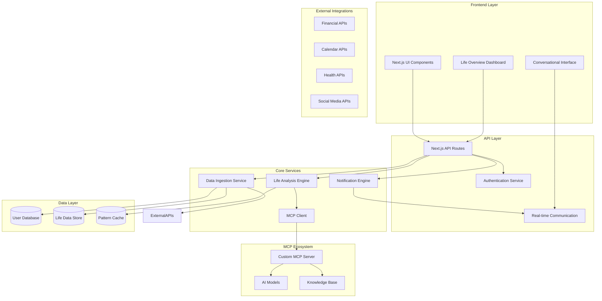
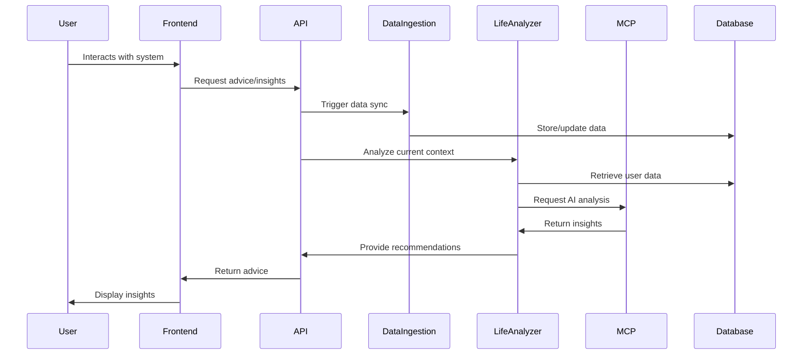

# Design Document

## Overview

The Cockpit system is designed as an AI-powered life advisory platform that leverages Model Context Protocol (MCP) to provide intelligent, holistic guidance across all aspects of a user's life. The architecture follows a microservices-inspired approach within a Next.js monolith, with clear separation between data ingestion, AI processing, and user interaction layers.

The system operates on the principle of continuous data synthesis - constantly ingesting, analyzing, and contextualizing personal data to build a comprehensive understanding of the user's life patterns, goals, and challenges. This understanding enables proactive, personalized advice that considers cross-domain impacts and long-term implications.

## Architecture

### High-Level Architecture



### Data Flow Architecture



## Components and Interfaces

### Frontend Components

#### Conversational Interface
- **Purpose**: Primary interaction method with the AI advisor
- **Key Features**: 
  - Natural language processing for user queries
  - Context-aware conversation history
  - Rich media support for data visualization
  - Voice input/output capabilities
- **Technology**: React components with WebSocket for real-time communication

#### Life Overview Dashboard
- **Purpose**: Visual representation of life patterns and insights
- **Key Features**:
  - Customizable widget layout
  - Real-time data visualization
  - Cross-domain correlation displays
  - Alert and notification center
- **Technology**: React with data visualization libraries (D3.js, Chart.js)

#### Data Connection Hub
- **Purpose**: Manage external data source integrations
- **Key Features**:
  - OAuth flow management for external services
  - Data source status monitoring
  - Privacy control settings
  - Manual data input forms
- **Technology**: React forms with secure authentication flows

### Backend Services

#### Data Ingestion Service
```typescript
interface DataIngestionService {
  connectDataSource(source: DataSourceConfig): Promise<ConnectionResult>;
  syncData(sourceId: string): Promise<SyncResult>;
  processRawData(data: RawLifeData): Promise<ProcessedLifeData>;
  validateDataIntegrity(data: LifeData): Promise<ValidationResult>;
}

interface DataSourceConfig {
  type: 'financial' | 'calendar' | 'health' | 'social' | 'manual';
  credentials: EncryptedCredentials;
  syncFrequency: SyncSchedule;
  dataTypes: string[];
}
```

#### Life Analysis Engine
```typescript
interface LifeAnalysisEngine {
  analyzePatterns(userId: string, timeframe: TimeRange): Promise<LifePatterns>;
  generateInsights(patterns: LifePatterns, context: UserContext): Promise<Insights>;
  detectAnomalies(data: LifeData): Promise<Anomaly[]>;
  predictTrends(historicalData: LifeData): Promise<TrendPrediction[]>;
}

interface LifePatterns {
  financial: FinancialPatterns;
  emotional: EmotionalPatterns;
  career: CareerPatterns;
  health: HealthPatterns;
  relationships: RelationshipPatterns;
  crossDomainCorrelations: Correlation[];
}
```

#### MCP Integration Client
```typescript
interface MCPClient {
  sendAnalysisRequest(data: LifeData, query: string): Promise<AIResponse>;
  getProactiveInsights(userProfile: UserProfile): Promise<ProactiveInsight[]>;
  processConversation(messages: ConversationHistory): Promise<ConversationResponse>;
  requestAdvice(situation: LifeSituation): Promise<AdviceResponse>;
}

interface AIResponse {
  insights: string[];
  recommendations: Recommendation[];
  confidence: number;
  reasoning: string;
  followUpQuestions?: string[];
}
```

### Data Models

#### Core User Model
```typescript
interface User {
  id: string;
  profile: UserProfile;
  preferences: UserPreferences;
  privacySettings: PrivacySettings;
  connectedSources: DataSource[];
  createdAt: Date;
  lastActive: Date;
}

interface UserProfile {
  demographics: Demographics;
  goals: LifeGoal[];
  values: PersonalValue[];
  riskTolerance: RiskProfile;
  communicationStyle: CommunicationPreferences;
}
```

#### Life Data Models
```typescript
interface LifeData {
  userId: string;
  domain: LifeDomain;
  timestamp: Date;
  data: DomainSpecificData;
  source: DataSource;
  confidence: number;
  tags: string[];
}

type LifeDomain = 'financial' | 'career' | 'health' | 'emotional' | 'social' | 'personal';

interface FinancialData extends DomainSpecificData {
  accounts: Account[];
  transactions: Transaction[];
  investments: Investment[];
  goals: FinancialGoal[];
}

interface EmotionalData extends DomainSpecificData {
  moodEntries: MoodEntry[];
  stressLevels: StressMetric[];
  relationshipEvents: RelationshipEvent[];
  lifeEvents: LifeEvent[];
}
```

#### Insight and Recommendation Models
```typescript
interface Insight {
  id: string;
  userId: string;
  type: InsightType;
  title: string;
  description: string;
  impact: ImpactLevel;
  confidence: number;
  supportingData: LifeData[];
  generatedAt: Date;
  expiresAt?: Date;
}

interface Recommendation {
  id: string;
  insightId: string;
  action: string;
  reasoning: string;
  priority: Priority;
  estimatedEffort: EffortLevel;
  expectedOutcome: string;
  crossDomainImpacts: DomainImpact[];
}
```

## Error Handling

### Error Classification System
- **Data Ingestion Errors**: Connection failures, authentication issues, data format problems
- **Analysis Errors**: Insufficient data, processing timeouts, model failures
- **MCP Communication Errors**: Network issues, service unavailability, rate limiting
- **User Experience Errors**: Invalid inputs, permission issues, session timeouts

### Error Recovery Strategies
```typescript
interface ErrorHandler {
  handleDataIngestionError(error: DataIngestionError): Promise<RecoveryAction>;
  handleAnalysisError(error: AnalysisError): Promise<FallbackStrategy>;
  handleMCPError(error: MCPError): Promise<RetryStrategy>;
  logError(error: SystemError): Promise<void>;
}

interface RecoveryAction {
  type: 'retry' | 'fallback' | 'manual_intervention' | 'graceful_degradation';
  delay?: number;
  maxRetries?: number;
  fallbackData?: any;
  userNotification?: string;
}
```

### Graceful Degradation
- **Offline Mode**: Cache recent insights and allow basic functionality
- **Partial Data**: Provide advice based on available data with confidence indicators
- **Service Outages**: Queue requests and provide cached recommendations
- **Rate Limiting**: Implement intelligent request batching and prioritization

## Testing Strategy

### Unit Testing
- **Data Processing Functions**: Validate data transformation and analysis logic
- **MCP Integration**: Mock MCP responses and test client behavior
- **Business Logic**: Test insight generation and recommendation algorithms
- **Utility Functions**: Validate helper functions and data validation

### Integration Testing
- **API Endpoints**: Test complete request/response cycles
- **Database Operations**: Validate data persistence and retrieval
- **External Service Integration**: Test OAuth flows and data synchronization
- **MCP Communication**: Test end-to-end AI advisory workflows

### End-to-End Testing
- **User Journeys**: Test complete user workflows from data connection to advice
- **Cross-Domain Analysis**: Validate holistic insights across life domains
- **Real-time Features**: Test WebSocket communication and live updates
- **Error Scenarios**: Test system behavior under various failure conditions

### Performance Testing
- **Data Processing**: Test large dataset handling and processing times
- **Concurrent Users**: Validate system performance under load
- **MCP Response Times**: Monitor AI processing latency
- **Database Performance**: Test query optimization and indexing strategies

### Security Testing
- **Authentication**: Test secure login and session management
- **Data Encryption**: Validate end-to-end encryption of sensitive data
- **API Security**: Test rate limiting, input validation, and authorization
- **Privacy Controls**: Validate user data access and deletion capabilities

## Security and Privacy Considerations

### Data Protection
- **Encryption at Rest**: AES-256 encryption for all stored personal data
- **Encryption in Transit**: TLS 1.3 for all API communications
- **Key Management**: Secure key rotation and hardware security modules
- **Data Minimization**: Collect only necessary data for advisory functions

### Access Control
- **Authentication**: Multi-factor authentication with biometric options
- **Authorization**: Role-based access control with granular permissions
- **Session Management**: Secure session tokens with automatic expiration
- **API Security**: Rate limiting, input validation, and CORS protection

### Privacy Controls
- **Data Portability**: Export user data in standard formats
- **Right to Deletion**: Complete data removal with verification
- **Consent Management**: Granular consent for different data types
- **Transparency**: Clear data usage explanations and audit logs